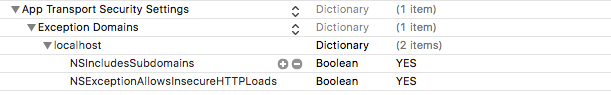

# PactMacOSExample

  

An example macOS app demonstrating the use of PactConsumerSwift (https://github.com/DiUS/pact-consumer-swift) framework using Carthage.

### Requirements

- Xcode 9 and Swift 4
- Run `sudo gem install pact-mock_service -v 2.1.0` in your terminal.
- Add exception to allow http calls by editing your `info.plist`:  

### Workflow
- Create your MacOS app.
- Add source code and write your tests.
- Update Test pre- and -post scripts to start and stop pact mock service.
- Run your tests.
- Grab your `./tmp/pacts/_your_provider-your_client.json` pact file to share with developers working on the API provider or submit to a [Pact Broker](https://github.com/pact-foundation/pact_broker).
- Celebrate :tada:
